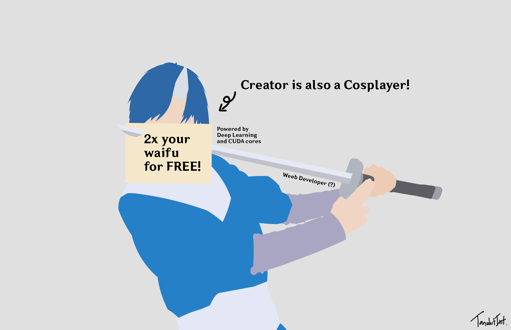
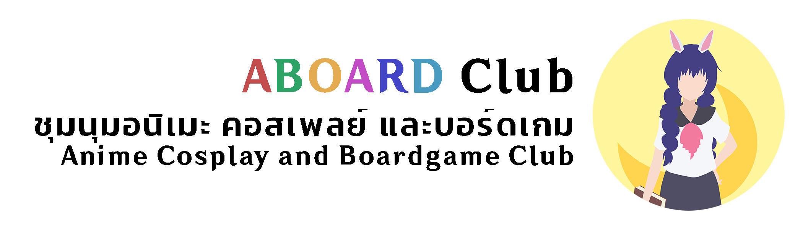
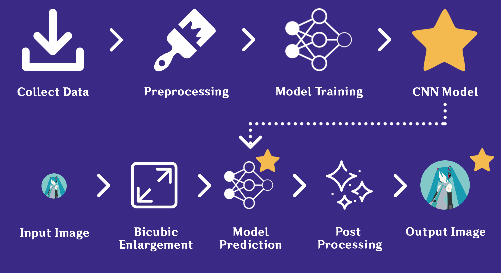
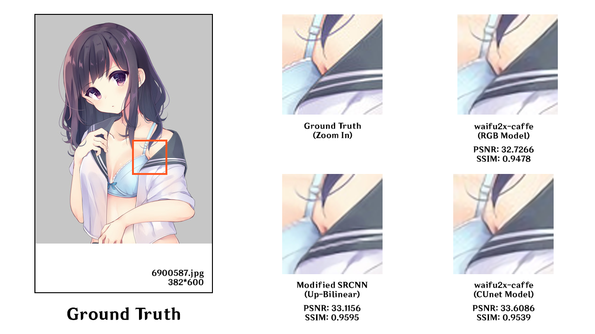
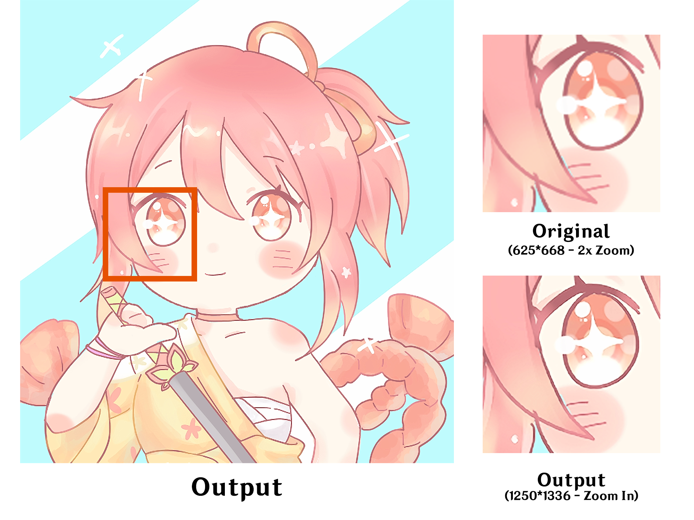
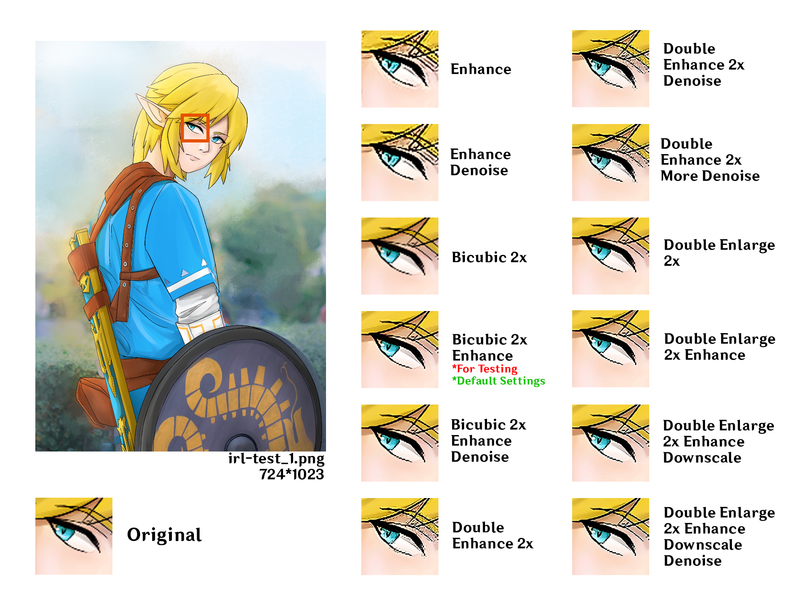
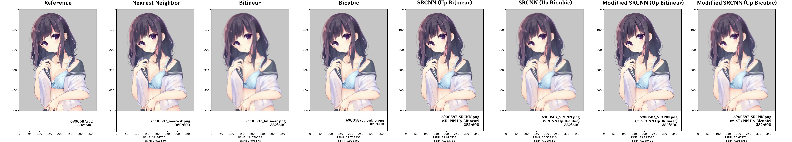
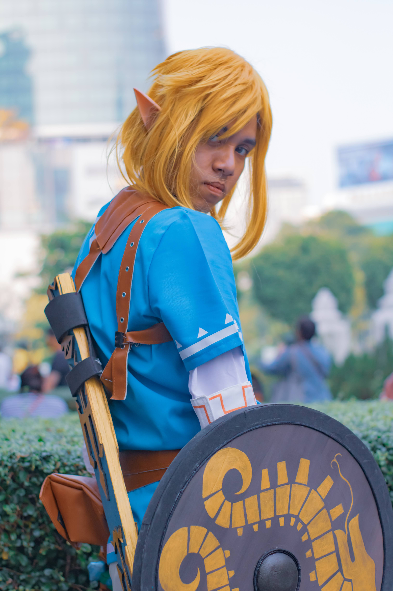

# SRCNN-anime

#### A Modified Super-Resolution Convolutional Neural Network (m-SRCNN) build for artwork, anime, and illustration.  

#### ICITEE 2021 Accepted - Enhancement of Anime Imaging Enlargement Using Modified Super-Resolution CNN  

#### For references and details please scroll down

A 4th year Senior Project Github repository for  
"Artwork Enlargement and Quality Improvement using Machine Learning"

  

[Image Processing and Deep Learning Laboratory (IPDL Lab)](http://prip.it.kmitl.ac.th/)  
Faculty of Information Technology, King Mongkut's Institute of Technology Ladkrabang  

Tanakit Intaniyom - [TanakitInt](https://github.com/TanakitInt)  
Warinthorn Thananporn - [TIVOLI777](https://github.com/TIVOLI777)  

Professor :  
Asst. Prof. Dr. Kuntpong Woraratpanya - [Google Scholar](https://scholar.google.com/citations?user=q13vj6UAAAAJ&hl=en)

Duration : 11 February 2020 - 14 January 2021 (Senior Project) - 8 September 2021 (Paper)  

Public Release date : 14 January 2021  

Paper Release date : November 2021 (ICITEE 2021 Accepted)  
(Insert arxiv Link here)  

  

Special thanks for Sample images :  
[Anime Cosplay and Boardgame Club](https://www.facebook.com/AniBoardIT) 

Video Presentation:  
https://youtu.be/tqI4JqqG0Yk  

PDF Powerpoint Presentation:  
https://drive.google.com/file/d/1_JO13a_-Afj_UnDLnbtQcHtDuD8_0z3n/view?usp=sharing  

## I'm interested in this project!  

 

#### Buy me a coffee! ☕ (Thank you very much!) [Paypal](https://www.paypal.me/TanakitInt)

If you interested in this project, feel free to contact me at [Email at my GitHub Profile](https://github.com/TanakitInt/) or [Twitter](https://twitter.com/TanakitInt)  
For any education purposes, you can directly use my [GitHub repository name](https://github.com/TanakitInt/SRCNN-anime) as reference.  
For any other purposes, such as commercial product, please contact me before using any of this project.  

## Issue(s), Bug(s) report, etc...

We welcome you to report any bug(s) or issue(s).  
We're appreciated in your finding! 
You can directly raise the issue(s) in this GitHub repository or contact me at [Email at my GitHub Profile](https://github.com/TanakitInt/) or [Twitter](https://twitter.com/TanakitInt) 

## Simple Diagram  
For more detailed diagram, [Click here](Diagram/figures)

More Results from experiment  
[Click here for more experiment samples](sample/)

### Sample Comparison with waifu2x  

  

### Real world example (Default Settings)

## Train your own model  

### Input Output Comparisons  

[Click here for more Input comparisons](sample/input) 

[Click here for more Output comparisons](sample/output) 

### Download pre-trained weights (.h5 files)  
[Click here to Download](_model)  

There are 4 models seperated which are:  
- **SRCNN original up bicubic** - Original SRCNN trained with **bicubic** upscaled datasets  
- **SRCNN original up bilinear** - Original SRCNN trained with **bilinear** upscaled datasets  
- **m-SRCNN up bicubic** - Our m-SRCNN trained with **bicubic** upscaled datasets  
- **m-SRCNN up bilinear (Best model)** - Our m-SRCNN trained with **bilinear** upscaled datasets  

### INSTALL PYTHON PACKAGE
`` 0_PYHON_3_PACKAGE_INSTALL.bat ``

### PREPARE DATA  
**Input your own data in dataset folder ``dataset/original/`` (Training set) and ``dataset/test/`` (Validation set) first!**   
(Split train-test as your own wish, Recommended : 80/20)  

#### **Prepare data quick start**  
`` 1_PREPARE_DATA_QUICK_START.bat ``  

### TRAINING  

#### **Training quick start**  
`` 2_TRAINING_QUICK_START.bat ``  

### PREDICTION

**Please input your image at `` user-input/ `` folder, the final output will be at `` user-output/ ``**

#### **For prediction quick start**  
`` 3_PREDICTION_QUICK_START.bat ``

#### **If you have reference for high resolution image**
For model testing, we need to have original high resolution for result comparison.  

If you have reference for high resolution image (Ground Truth),  
place it at `` input/ `` folder and rename to `` 1-ref.png ``.  
Make sure it's same resolution as output.    

### POST-PROCESSING

#### **For image denoising**
`` 4_IMG_POST_PROCESSING.bat ``

### ADDITIONAL FEATURE

### Feature Comparisons  

[Click here for more Feature comparison](Diagram/figures/fig_8_v2.png)

#### **Settings**
See `` Diagram/figures/fig_5_Program_Diagram_-_Framework_(Revised)_v5.png `` for usage. 
[Click here](Diagram/figures/fig_5_Program_Diagram_-_Framework_(Revised)_v5.png)

Please set the settings at `` settings/ ``

`` settings_2-passes.txt ``   
For Double Enhancement, 0 or 1. Default 0.  
  
`` settings_2-passes-denoise-as-input.txt ``   
For Double Enhancement input, 0 or 1. Default 1.  
  
`` settings_bicubic.txt ``   
For Bicubic scale enlargement input, possitive float. Default 2.  
  
`` settings_bilateral_filter.txt ``   
For Enhancement bilateral filter, float. Default 50.  
  
`` settings_fastNlMeans_filter.txt ``   
For Enhancement denoise filter, possitive interger or zero. Default 7.  
  
`` settings_final_bilateral_filter.txt ``   
For Double Enhancement bilateral filter, float. Default 100.  
  
`` settings_final_fastNlMeans_filter.txt ``   
For Double Enhancement denoise filter, possitive interger. Default 14.  
   
`` settings_final_medianblur_filter.txt ``   
For Double Enhancement Median Blur filter, possitive odd interger. Default 1.  
  
`` settings_updown.txt ``  
For Double Enlargement (Upsampling nx and 2x and Downsampling to n/2x), 0 or 1. Default 0.  

`` settings_updown-denoise-as-input.txt ``  
For Double Enlargement (updown) input, 0 or 1. Default 1.  

#### **Enlargement and Enhancement - DEFAULT RECOMMENDED**  
`` 10_1-PASS_SLOW.bat `` For Slow mode  
`` 11_1-PASS_EXPRESS.bat `` For Express mode  

#### **Image Enhancement Only**
`` 12_1-PASS_ENHANCEMENT_ONLY_EXPRESS.bat ``  

#### **Double Enhancement - MORE ENHANCEMENT**  
`` 20_2-PASSES_SLOW.bat `` For Slow mode  
`` 21_2-PASSES_EXPRESS.bat `` For Express mode  

#### **Double Enlargement - BETTER RESULTS FOR LOWER RESOLUTION IMAGE**  
`` 30_UPDOWN_SLOW.bat `` For Slow mode  
`` 31_UPDOWN_EXPRESS.bat `` For Express mode  

#### **Reference tests** 

### Hardware, Software and Limitation
Training Time : 2 Hours (for each single model)  
Training Epoch : 50

 - Hardware  
CPU = Intel Core i5-11400F  
GPU = Nvidia GeForce GTX 750Ti  
RAM = 16 GB  
SSD = 480 GB  

 - Core Software  
tensorflow==2.2.0  
CUDA==10.1.243  
cuDNN==7.6.5  
python==3.7.9  

 - Python 3.7.9 used Package  
keras==2.4.3  
opencv-python==4.4.0.44  
numpy==1.19.2  
matplotlib==3.3.2  
scikit-image==0.17.2  
h5py==2.10.0  

 - Other  
GPUtil==1.4.0  
pydotplus==2.0.2  

### Training, Validation, and Testing Datasets we used

Nico-illust : https://nico-opendata.jp/en/seigadata/index.html  

### Project References

- Based Paper : Image Super-Resolution Using Deep Convolutional Networks  
https://arxiv.org/abs/1501.00092  
http://mmlab.ie.cuhk.edu.hk/projects/SRCNN.html

- Projects in Machine Learning : Beginner To Professional  
https://www.udemy.com/course/machine-learning-for-absolute-beginners/  
https://medium.com/datadriveninvestor/using-the-super-resolution-convolutional-neural-network-for-image-restoration-ff1e8420d846

### Github Repository References

- waifu2x    
https://github.com/nagadomi/waifu2x  
https://github.com/lltcggie/waifu2x-caffe  

- Code   
https://github.com/MarkPrecursor/SRCNN-keras  
https://github.com/rezaeiii/SRCNN  
https://github.com/Maximellerbach/Image-Processing-using-AI  
https://github.com/tegg89/SRCNN-Tensorflow 

### Footnote

**SRCNN-anime Project was made by this GitHub owner so do not use as your own project/work, copyrighted work.** 

Thanks for the original work anime-style art images from Nikamon Saelim, Apinyarut Manakul, and Patharapan Hongtawee and everyone those who contribute and support to this project.

  

