# SRCNN-anime

#### A Modified Super-Resolution Convolutional Neural Network (SRCNN) build for artwork, anime and illustration.

 

#### For references and details please scroll down

A 4th year Senior Project Github repository for  
"Artwork Enlargement and Quality Improvement using Machine Learning"

  

[Image Processing and Deep Learning Laboratory (IPDL Lab)](http://prip.it.kmitl.ac.th/)  
Faculty of Information Technology, King Mongkut's Institute of Technology Ladkrabang  

Tanakit Intaniyom - [TanakitInt](https://github.com/TanakitInt)   
Warinthorn Thananporn - [TIVOLI777](https://github.com/TIVOLI777)  

Professor :  
Asst. Prof. Dr. Kuntpong Woraratpanya

Duration : 11 February 2020 - 14 January 2021 (11 months)  

Public Release date : 14 January 2021  

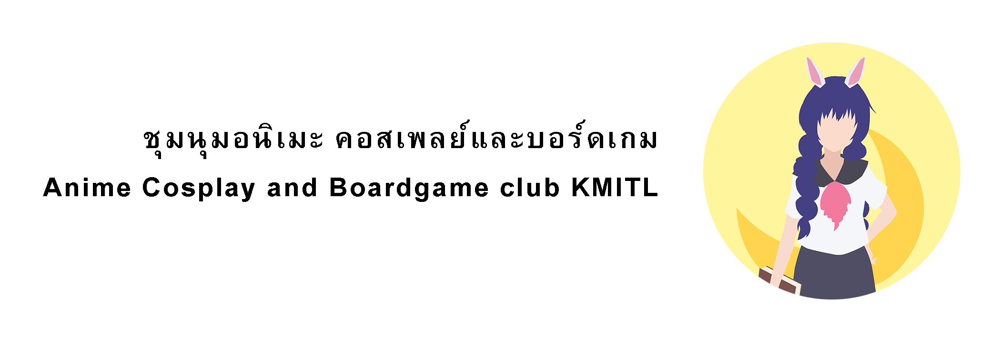  

Special thanks for Sample images :  
[Anime Cosplay and Boardgame Club](https://www.facebook.com/AniBoardIT)  
 
## I'm interested in this project!  

 

#### Buy me a coffee! ☕ (Thank you very much!) [Paypal](https://www.paypal.me/TanakitInt)

If you interested in this project, feel free to contact me at [Email at my GitHub Profile](https://github.com/TanakitInt/) or [Twitter](https://twitter.com/TanakitInt)  
For any education purposes, you can directly use my [GitHub repository name](https://github.com/TanakitInt/SRCNN-anime) as reference.  
For any other purposes, such as commercial product, please contact me before using any of this project.  

## Issue(s), Bug(s) report, etc...

We welcome you to report any bug(s) or issue(s).  
We're appreciated in your finding! 
You can directly raise the issue(s) in this GitHub repository or contact me at [Email at my GitHub Profile](https://github.com/TanakitInt/) or [Twitter](https://twitter.com/TanakitInt) 

## Simple Diagram  
For more detailed diagram, [Click here](Diagram/Code-diagram) 

## Sample Output  

More Results from experiment  
[Click here for more experiment samples](sample/Testing-set)

### Sample Comparison for Win and Lose case with waifu2x
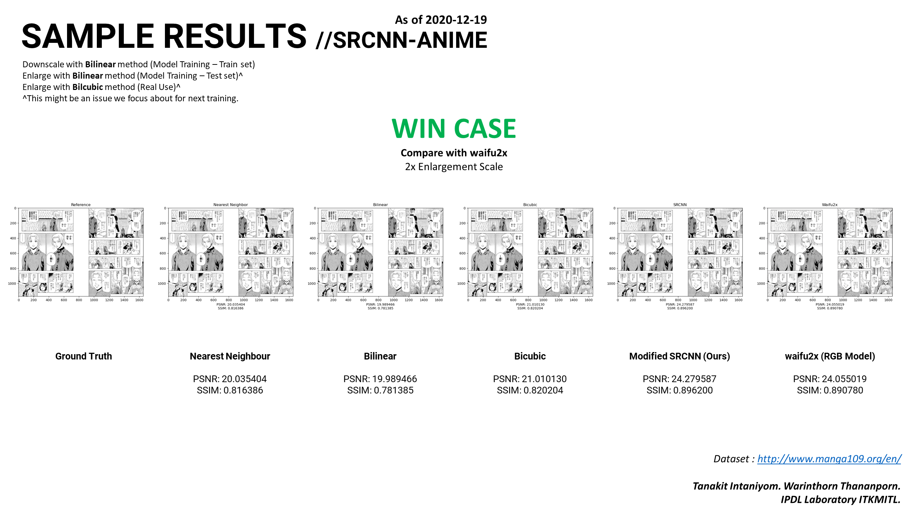
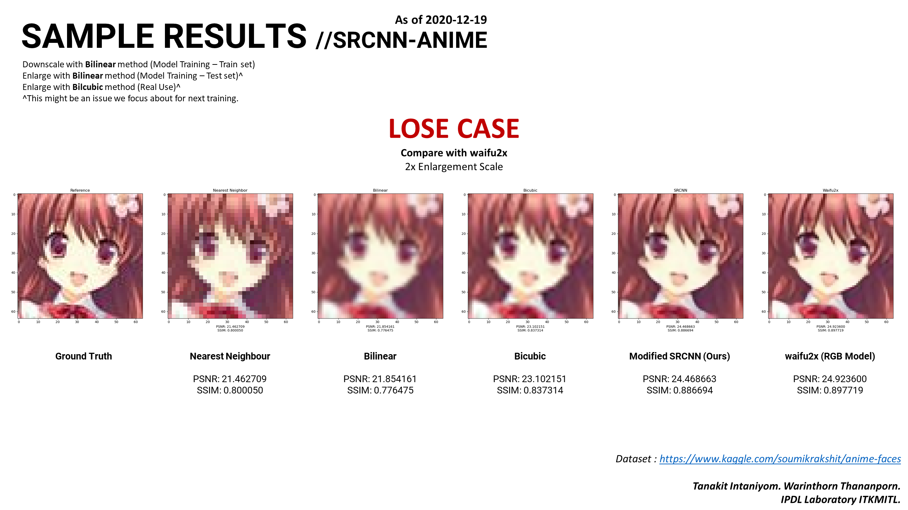

### Zoom In
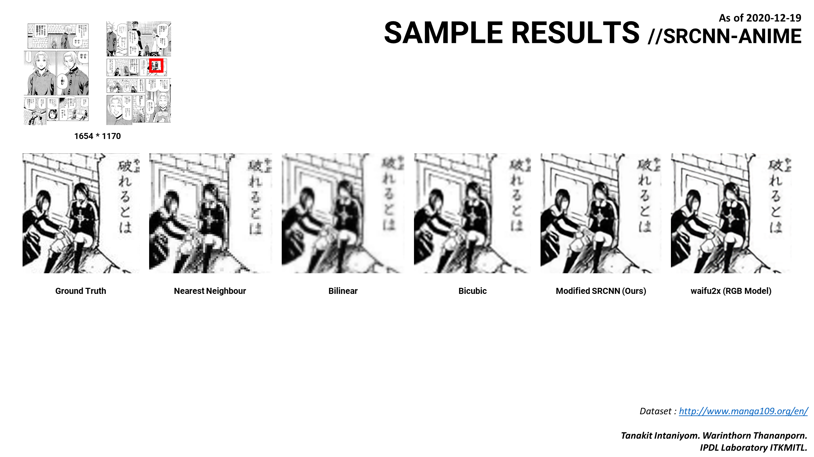
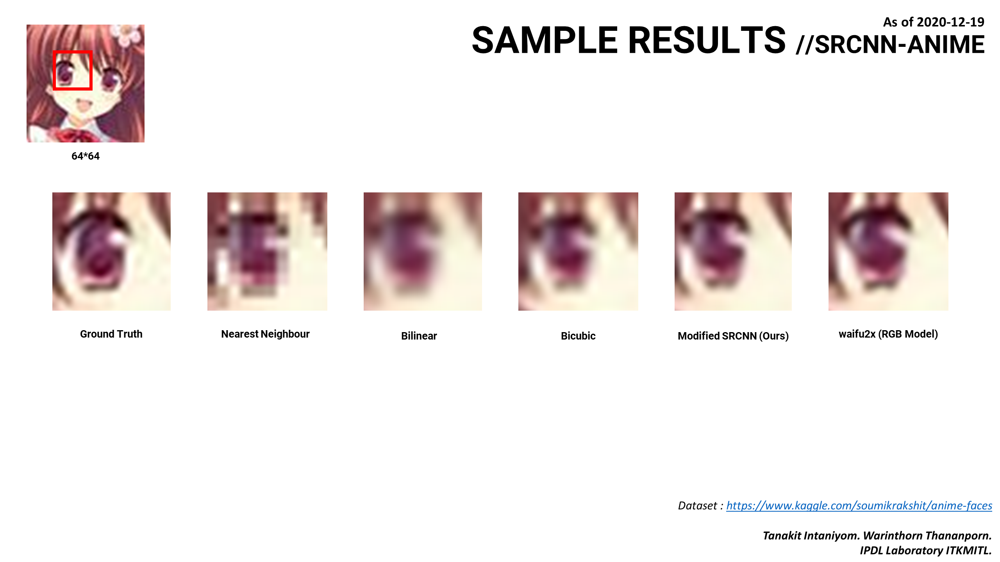

### Real world example (Default Settings)
Image acquired from [Anime Cosplay and Boardgame Club](https://www.facebook.com/AniBoardIT) 2014 Logo Competition  
[Click here for more real world samples](sample/Real-world-sample)

(c) 2014 Yokkass Kongpueng, ABOARD Club ITKMITL  
#### Input  

#### Output   
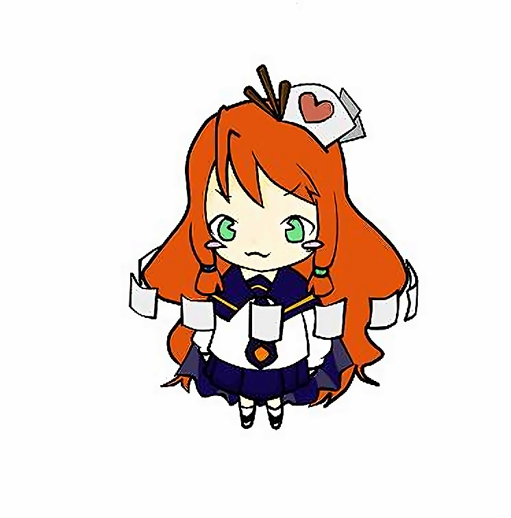

(c) 2014 Sathika RuikaLism Lim, ABOARD Club ITKMITL  
#### Input  

#### Output  
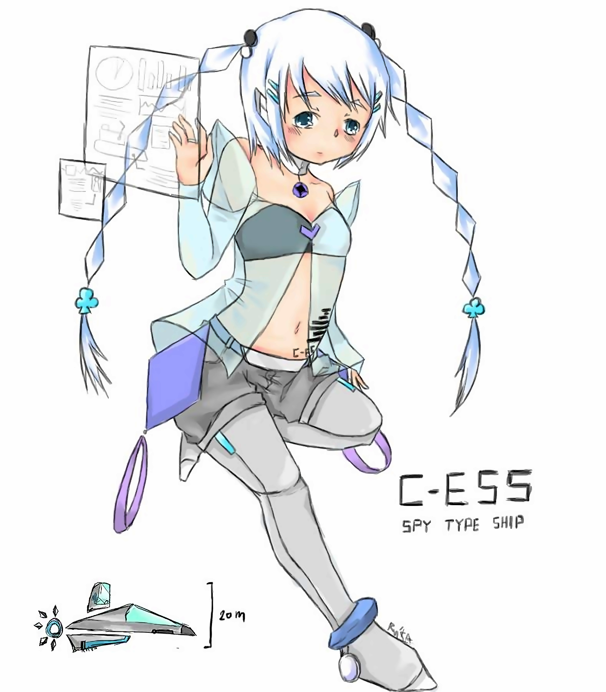

## Train your own model  

### Input Output Comparisons  

[Click here for more Input Output comparisons](sample/Real-world-sample/1)  

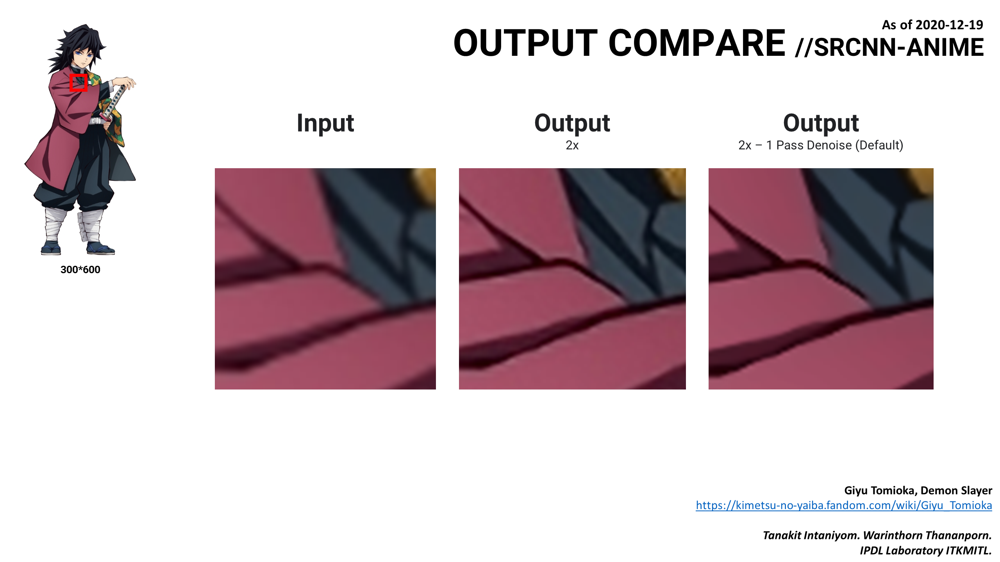

### Download prepared datasets and pre-trained weights (.h5 files)  
https://drive.google.com/drive/folders/1m27aL3ZZsIlG3ahuZnMsubPYNa2QdfUH?usp=sharing  

### INSTALL PYTHON PACKAGE
`` 0_PYHON_3_PACKAGE_INSTALL.bat ``

### PREPARE DATA  
**Input your own data in dataset folder ``dataset/original/`` (Training set) and ``dataset/test/`` (Testing set) first!**   
(Split train-test as your own wish, Recommended : 80/20)  

#### **Prepare data quick start**  
`` 1_PREPARE_DATA_QUICK_START.bat ``  

### TRAINING  

#### **Training quick start**  
`` 2_TRAINING_QUICK_START.bat ``  

### PREDICTION

**Please input your image at `` user-input/ `` folder, the final output will be at `` user-output/ ``**

#### **For prediction quick start**  
`` 3_PREDICTION_QUICK_START.bat ``

#### **If you have reference for high resolution image**
For model testing, we need to have original high resolution for result comparison.  

If you have reference for high resolution image (Ground Truth),  
place it at `` input/ `` folder and rename to `` 1-ref.png ``.  
Make sure it's same resolution as output.    

### POST-PROCESSING

#### **For image denoising**
`` 4_IMG_POST_PROCESSING.bat ``

### ADDITIONAL FEATURE

### Feature Comparisons  

[Click here for more Feature comparison](sample/Feature-compare)

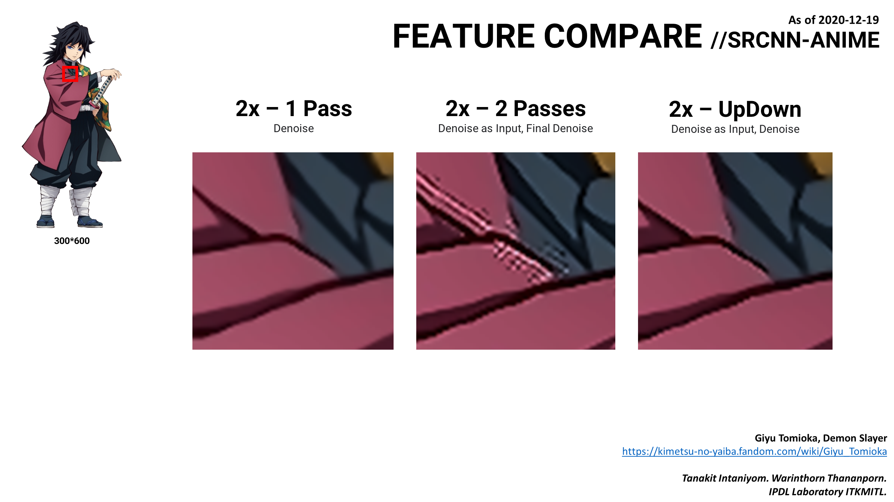  

#### **Settings**
See `` Diagram/Code-diagram `` for usage.
Please set the settings at `` settings/ ``

`` settings_2-passes.txt ``   
For 2 passes, 0 or 1. Default 0.  
  
`` settings_2-passes-denoise-as-input.txt ``   
For 2 passes input, 0 or 1. Default 1.  
  
`` settings_bicubic.txt ``   
For bicubic scale enlargement input, possitive float. Default 2.  
  
`` settings_bilateral_filter.txt ``   
For 1 pass bilateral filter, float. Default 50.  
  
`` settings_fastNlMeans_filter.txt ``   
For 1 pass denoise filter, possitive interger or zero. Default 7.  
  
`` settings_final_bilateral_filter.txt ``   
For 2 passes bilateral filter, float. Default 100.  
  
`` settings_final_fastNlMeans_filter.txt ``   
For 2 passes denoise filter, possitive interger. Default 14.  
   
`` settings_final_medianblur_filter.txt ``   
For 2 passes Median Blur filter, possitive odd interger. Default 1.  
  
`` settings_updown.txt `` **BETA**  
For Upsampling nx and 2x and Downsampling to n/2x, 0 or 1. Default 0.  

`` settings_updown-denoise-as-input.txt `` **BETA**  
For updown input, 0 or 1. Default 1.  

#### **1 Pass - DEFAULT RECOMMENDED** 
`` 10_1-PASS_SLOW.bat `` For Slow mode  
`` 11_1-PASS_EXPRESS.bat `` For Express mode  

#### **1 Pass - ENHANCEMENT ONLY**
`` 12_1-PASS_ENHANCEMENT_ONLY_EXPRESS.bat ``

#### **2 Passes - MORE ENHANCEMENT WITH SOME CHECKERBOARD ARTIFACT**
`` 20_2-PASSES_SLOW.bat `` For Slow mode  
`` 21_2-PASSES_EXPRESS.bat `` For Express mode  

#### **Upsampling nx and 2x and Downsampling to n/2x - BETTER RESULTS FOR LOWER RESOLUTION IMAGE (BETA)**
`` 30_UPDOWN_SLOW.bat `` For Slow mode  
`` 31_UPDOWN_EXPRESS.bat `` For Express mode 

#### **Manual Reference tests**  

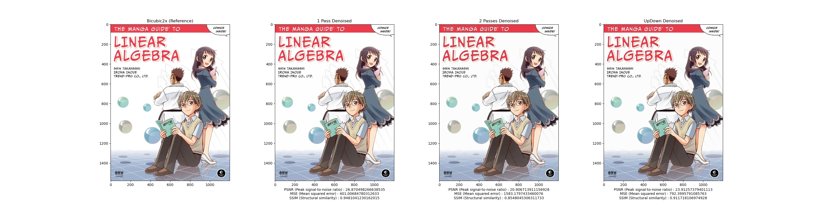

Go to `` util/ref-test/ ``  
A folder `` in-test/ `` is for input image, the folder will contain a folder `` 1-ref/ ``, `` 2 ``, `` 3 ``, `` 4 ``.  
Place each "PNG" image in each folder, the image in `` 1-ref/ `` will be a reference for example,  
`` in-test/1-ref/image.png_srcnn-anime-bicubic-2.0x.png ``  
`` in-test/2/image.png_srcnn-anime-bicubic-2.0x-enhanced.png ``  
`` in-test/3/image.png_srcnn-anime-bicubic-2.0x-enhanced-denoised.png ``  
`` in-test/4/image.png_srcnn-anime_2-PASSES_2.0x-enhanced-denoised.png ``   
Then run a fie `` ref-test.py `` the figure output will be at `` out-fig/ ``  

Please note that manual reference test must contain all 4 any same resolution images.

### Average Table Results from all Training Datasets  
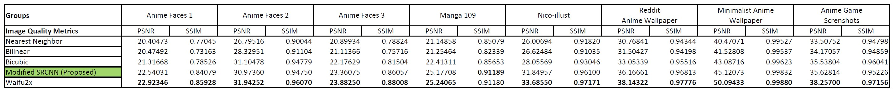

### Hardware, Software and Limitation
Training Time : 14 Day  
Training Epoch : 2500  

(Prototype Training Time : 160 Minutes  
Prototype Training Epoch : 20)  

 - Hardware (For real training)  
CPU = Intel i7-8700K  
GPU = Nvidia GeForce GTX 1070Ti 2x SLI  
RAM = 32 GB  
SSD = 480 GB  

 - Hardware (For test run and prototype)  
CPU = Intel i3-2100  
GPU = Nvidia GeForce GT 710  
RAM = 8 GB  
HDD = 500 GB  

 - Hardware (Backup)  
CPU = Intel i7-6700HQ  
GPU = Nvidia GeForce GTX 960M  
RAM = 16 GB  
SSD = 240 GB  

 - Core Software  
tensorflow==2.2.0  
CUDA==10.1.243  
cuDNN==7.6.5  
python==3.7.9  

 - Python 3.7.9 used Package  
keras==2.4.3  
opencv-python==4.4.0.44  
numpy==1.19.2  
matplotlib==3.3.2  
scikit-image==0.17.2  
h5py==2.10.0  

 - Other  
GPUtil==1.4.0  
pydotplus==2.0.2  

 - Limitation on our hardware setup (For real training)  
**1 Pass** input image (1750 x 1750)  
**2 Passes** input image (1750 x 1750)  
**UPDOWN-2x** input image (875 x 875)  
**Enhancement only** input image (3500 x 3500)  

We recommended to run python in Anaconda virtual environment so it can be create and delete right away. Easy to manage python installation package.

### Training and Testing Datasets we used

Anime Faces : https://www.kaggle.com/soumikrakshit/anime-faces  
Anime Faces 2 : https://www.kaggle.com/dmcgow/animation/  
Anime Faces 3 : https://github.com/bchao1/Anime-Face-Dataset  
Manga 109 : http://www.manga109.org/en/  
Nico-illust : https://nico-opendata.jp/en/seigadata/index.html  
Reddit Anime Wallpaper : https://www.reddit.com/r/Animewallpaper  
Minimalist Anime Wallpaper (Ours): https://www.deviantart.com/tanakitint  
Genshin Impact Screenshots (Ours capture) : https://genshin.mihoyo.com/en  

### Possible Future Works  

- Change all Training and Testing image to PNG
- In the Data Preprocessing process, Change enlargement method from Bilinear to Bicubic
- Develop and Deploy Web Application **(Confirmed : Schedule on Mid 2021)**
- Modify the Model architecture

### Current Issue on some Input Image (Depends)  

- Model can't keep PNG transparency  

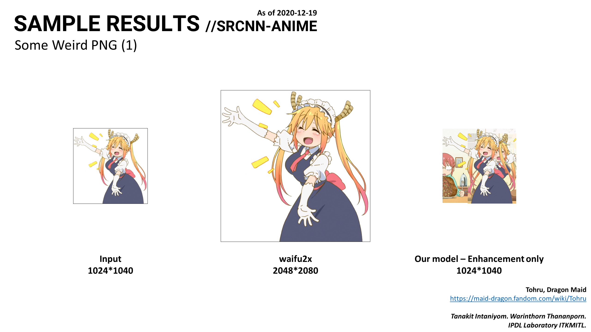
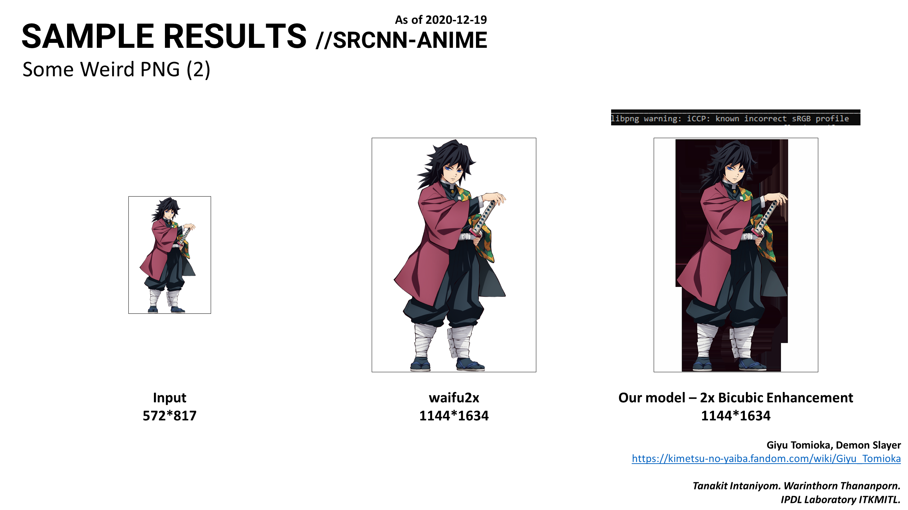

### Project References

- Based Paper : Image Super-Resolution Using Deep Convolutional Networks  
https://arxiv.org/abs/1501.00092  
http://mmlab.ie.cuhk.edu.hk/projects/SRCNN.html

- Projects in Machine Learning : Beginner To Professional  
https://www.udemy.com/course/machine-learning-for-absolute-beginners/  
https://medium.com/datadriveninvestor/using-the-super-resolution-convolutional-neural-network-for-image-restoration-ff1e8420d846

### Github Repository References

- waifu2x    
https://github.com/nagadomi/waifu2x  
https://github.com/lltcggie/waifu2x-caffe  

- Code   
https://github.com/MarkPrecursor/SRCNN-keras  
https://github.com/rezaeiii/SRCNN  
https://github.com/Maximellerbach/Image-Processing-using-AI  
https://github.com/tegg89/SRCNN-Tensorflow  

### Footnote for copyright claims and commerial :

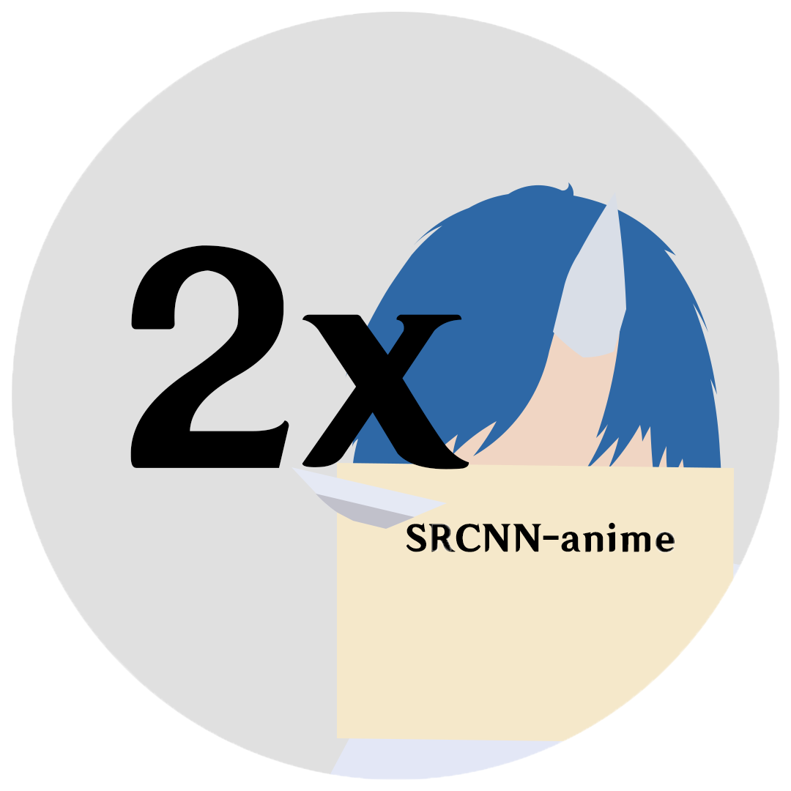  

**SRCNN-anime Project Icon and Banner was made by this GitHub owner so do not use as your own project/work, copyrighted work.**  
All Anime image was acquired from Internet since it's not for commerial use, "[**Fair use**](https://en.wikipedia.org/wiki/Fair_use)" applied.  
We're not working on any commerial product.  
This is our educational research, So I will not have any commerial stuff. (I don't know how to make into commerial product at all!)  

